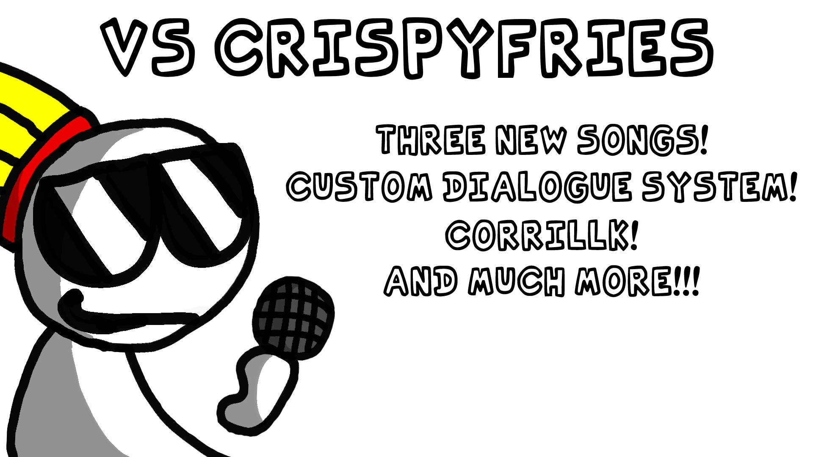

# Friday Night Funkin': Vs Crispyfries
## Friday Night Funkin'
**Friday Night Funkin'** is a rhythm game originally made for Ludum Dare 47 "Stuck In a Loop".

Links: **[itch.io page](https://ninja-muffin24.itch.io/funkin) ⋅ [Newgrounds](https://www.newgrounds.com/portal/view/770371) ⋅ [source code on GitHub](https://github.com/ninjamuffin99/Funkin)**
> Uh oh! Your tryin to kiss ur hot girlfriend, but her MEAN and EVIL dad is trying to KILL you! He's an ex-rockstar, the only way to get to his heart? The power of music... 

## Vs Crispyfries

**FNF: Vs Crispyfries** is a mod for Kade Engine! Featuring my friend Crispyfries rap battling with boyfriend in the void!

Links: **[GameBanana mod page](https://gamebanana.com/wips/65207)**

## Kade Engine
**Kade Engine** is a mod for Friday Night Funkin', including a full engine rework, replays, and more.

Links: **[GameBanana mod page](https://gamebanana.com/gamefiles/16761) ⋅ [play in browser](https://funkin.puyo.xyz) ⋅ [latest stable release](https://github.com/KadeDev/Kade-Engine/releases/latest) ⋅ [latest development build (windows)](https://ci.appveyor.com/project/KadeDev/kade-engine-windows/branch/master/artifacts) ⋅ [latest development build (macOS)](https://ci.appveyor.com/project/KadeDev/kade-engine-macos/branch/master/artifacts) ⋅ [latest development build (linux)](https://ci.appveyor.com/project/KadeDev/kade-engine-linux/branch/master/artifacts)**

**REMEMBER**: This is a **mod**. This is not the vanilla game and should be treated as a **modification**. This is not and probably will never be official, so don't get confused.

# Credits
### Friday Night Funkin'
 - [ninjamuffin99](https://twitter.com/ninja_muffin99) - Programming
 - [PhantomArcade3K](https://twitter.com/phantomarcade3k) and [Evilsk8r](https://twitter.com/evilsk8r) - Art
 - [Kawai Sprite](https://twitter.com/kawaisprite) - Music

This game was made with love to Newgrounds and its community. Extra love to Tom Fulp.
### Kade Engine
- [KadeDeveloper](https://twitter.com/KadeDeveloper) - Maintainer and lead programmer
- [The contributors](https://github.com/KadeDev/Kade-Engine/graphs/contributors)

### Vs Crispyfries
- [BlazeDev](https://github.com/BlazeGamesYT) - Manager, Programmer, and Animation Helper
- [Crispyfries](https://gamebanana.com/members/2083835) - Writer, Artist, and Animator
